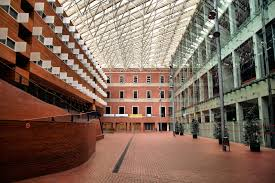
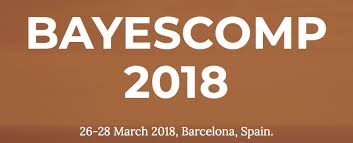

sections:
  ##############################################################################
  # 0 · Introductory paragraph for the Seminars section
  ##############################################################################
  - block: markdown
    content:
      title: 'Seminars'
      text: |
        Our main seminar series is the **Statistics Seminar at UPF**, organized by Chiara Amorino and Lorenzo Cappello.  
        We also run the *Internal Statistics Seminar* and a number of reading seminars.

  ##############################################################################
  # 1 · Dynamic list — Seminars (from *any* folder, filtered by tag)
  ##############################################################################
  - block: collection
    label: Seminars
    anchor: seminars                
    content:
      page_type: event
      tag: seminar                  # picks up both seminar folders
      archive_button: true
      archive_button_url: "/tags/seminar/"   # taxonomy archive
      order: desc
      count: 10
    design:
      view: compact
      show_date: true
      show_location: true
      columns: "1"

  ##############################################################################
  # 2 · Manually-curated Workshops & Conferences (static HTML cards)
  ##############################################################################
  - block: markdown
    content:
      title: 'Workshops & Conferences (last 10 years)'
      text: |
        <!-- CARD · Mathematical Aspects of Learning - 20 Years Later -->
        

          

            

              <a href="https://www.crm.cat/mathematical-aspects-of-learning-theory/"
                 target="_blank" rel="noopener">
                Mathematical Aspects of Learning — 20 Years Later
              </a>
            

            

              Workshop with talks by Piotr Zwiernik, Gergely Neu &amp; others.
            

            

              9–13&nbsp;Sep&nbsp;2024 · Casa Convalescència
            

          

          
        

        <!-- CARD · Mathematical Statistics and Learning 2021 -->
        

          

            

              <a href="https://dscbarcelona.wixsite.com/msl2020"
                 target="_blank" rel="noopener">
                Mathematical Statistics &amp; Learning 2021
              </a>
            

            

              Conference on high-dimensional statistics and ML theory.
            

            

              29&nbsp;Jun – 2&nbsp;Jul&nbsp;2021 · Casa Convalescència
            

          

          
        

        <!-- CARD · Google Focused Award mini-workshop -->
        

          

            

              Google Focused Award Mini-workshop
            

            

              Joint UPF &amp; Google Zurich workshop on machine-learning theory.
            

            

              7–8&nbsp;Mar&nbsp;2021 · UPF Campus Ciutadella
            

          

          
        

        <!-- CARD · BayesComp 2018 -->
        

          

            

              <a href="https://www.maths.nottingham.ac.uk/plp/pmztk/bayescomp/"
                 target="_blank" rel="noopener">
                10th BayesComp 2018
              </a>
            

            

              Advances in scalable Bayesian computation.
            

            

              26–28&nbsp;Mar&nbsp;2018 · UPF Auditorium
            

          

          
        

    design:
      columns: "1"